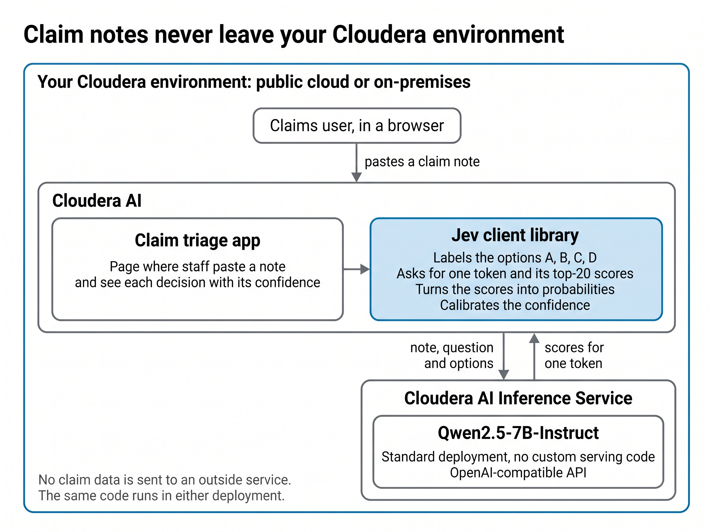

# Jev-style decisions on Cloudera AI

Use a large language model to make decisions: give it a piece of text, a question and
a fixed list of options, and get back a probability for each option. This repository
shows it on Cloudera AI, routing synthetic insurance claim notes.

## What Jev does on Cloudera AI

You've just deployed your first Jev-style application on Cloudera AI, and today you're
presenting it to one of your executives and an AI architect.

With all the buzz around Jev, it's easy to miss the basics: what exactly is it, and
what value can it bring? This fictional conversation is meant to answer both.

### Around the table

**You:** "First, let me explain what Jev is. I think of it as using large language
models to make decisions. In machine learning terms, it makes categorical
predictions. To do that with a language model, we frame the question so the model
chooses from a fixed list of options, and we get its answer back as a probability for
each option. Jev itself is a hosted service from a company called TypeSafe; what
we've built follows the same pattern, using an open model on our own platform."

"Now let's turn to how we're using it here. As an insurance company, we take in a
steady stream of new claims, and each one starts as a short note written when the
customer first reports the loss. Today, someone on our claims team reads every one of
those notes to decide which team handles the claim, and whether a senior adjuster
must review it before any payment. This application makes both decisions
automatically, with a confidence score for each option. Claims the model is sure
about can be routed straight through, and uncertain ones go to a person. On a test
set of synthetic claims, it chose the right team about 88% of the time."

**Executive:** "What's the value? We already have machine learning models, so how is
this different?"

**You:** "It's about speed, cost and control."

- **Days to start, not months.** A traditional model needs a project to collect and
  label thousands of past claims before it routes a single one. Here, someone writes
  down the rules and it starts.
- **No large labeling project.** A few hundred graded examples to check and calibrate
  it, not thousands to train it. And it runs on the Cloudera platform we already have.
- **Rule changes are quick.** Moving the senior-review threshold means editing one
  sentence and re-running a test, not retraining a model.
- **One approach, many decisions.** Claims routing today; complaint triage or document
  review tomorrow.
- **You decide what's automated.** The confidence score lets you choose where to draw
  the line between automatic routing and human review.

"Where a mature model already handles a stable decision well, keep it. This is for
the long list of decisions that never justified a data-science project."

**Executive:** "These notes are full of customer details. Where do they go?"

**You:** "They don't have to go anywhere. Instead of sending them to a SaaS AI
service, the whole thing can run inside our own Cloudera environment, under the
security and governance controls we already have."

**Executive:** "I'll be measured on accuracy. How do I know it stays accurate?"

**You:** "In production, we'd log every decision with the rules and the model that
made it. Each week, claims that people reviewed or sent back as misrouted become the
correct answers, giving us an accuracy score for every team. Warning signs, like a
sudden jump in fraud referrals, would show up early."

"When accuracy slips, we can re-tune the confidence scores, move the automation line,
or reword a rule, and test every change on a fixed set of graded claims before it
goes live. The model itself doesn't need retraining."

**Architect:** "Let me pick it up from there. Is Jev another model?"

**You:** "No, it's a pattern for how you call a model. You send it text, a question
and a fixed list of options, and you get back a probability for each option. The
model writes nothing. We ask the endpoint for one output token, plus its scores for
the most likely tokens, and read off the scores for the option letters."



The client library is the only Jev-specific part; the model and its endpoint are a
standard Cloudera AI Inference Service deployment.

**Architect:** "So you built custom model serving?"

**You:** "No. The model, Qwen2.5-7B-Instruct, runs as a standard deployment on
Cloudera AI Inference Service, behind its usual OpenAI-compatible API. Everything
Jev-specific lives in a small client library inside the application on Cloudera AI.
It labels the options, makes the call, turns the scores into probabilities, and
calibrates them, so that a confidence score tracks how often answers like it are
right."

**Architect:** "And where does the data go?"

**You:** "From the application to the inference endpoint and back. Both can run
inside our Cloudera environment, so claim data never has to go to an outside
service."

**Architect:** "Is this cloud-only?"

**You:** "That's the best part. A single Cloudera AI application can run on public
cloud or on-premises, and that holds for this one too. Switching between them is
easy: a few settings change, not the code."

**Architect:** "Can my team try it?"

**You:** "Yes. Start with the walkthrough notebook in the repository. It goes through
the library step by step, with nothing abstracted away, so you can see exactly what
goes in and what comes out. Then deploy the full application."

*The 88% is the team-question accuracy on the synthetic test set (0.877,
`results/test/summary.md`); the calibration error is under Results. All claim notes
are invented; see [Results](#results) and [Limitations](#limitations).*

## Ready to deploy?

The whole application is packaged as a Cloudera AMP, so you can run it in four steps:

1. Deploy a model on Cloudera AI Inference Service. We tested with
   Qwen2.5-7B-Instruct.
2. In Cloudera AI, create a project from the AMP in this repository.
3. In the project settings, set the endpoint address (`CAI_BASE_URL`) and the model
   name (`CAI_MODEL`).
4. Open the Claim triage application and paste in a claim note.

The sections below cover the details. Start with the walkthrough notebook,
[`quickstart.ipynb`](quickstart.ipynb): one question, four
options, the exact request, the raw response and how it is read.

## How it works

The client turns one standard OpenAI-compatible chat-completions call to
**Cloudera AI Inference Service** into probabilities over a fixed set of options. You give it a piece of text (`state`), a
`question` and a list of `options`. It asks the endpoint for exactly **one output
token** plus the **top-20 log-probabilities**, then reads the scores of the option
letters (A, B, C, …). There is no custom serving code: any model endpoint that
returns log-probabilities works.

This project answers the Databricks post
[Running open-Jev in SQL on Databricks](https://www.databricks.com/blog/running-open-jev-sql-databricks),
which serves [SemIf-OpenJev](https://github.com/TheoLeeCJ/SemIf-OpenJev) and calls
it from SQL. The `state` / `question` / `options` interface comes from Jev, as
SemIf-OpenJev uses it. The Databricks post is a deployment walkthrough and reports no
evaluation. This project goes further than that post in four ways:

- it uses a general instruction model, Qwen/Qwen2.5-7B-Instruct, on a standard
  endpoint;
- it chooses the question wording on a separate development set;
- it scores a held-out test set once;
- it reports accuracy, how often the answer changes when the options are reordered,
  calibration, and coverage.

It runs the same way on public and private cloud. Only environment variables
change.

## The example: routing insurance claim notes

The example uses synthetic first-notice-of-loss claim notes. Each note gets two
questions, both taken from `data/questions.json`:

- **team**: which team should handle the claim? The options are `standard`,
  `injury`, `fraud_review` and `coverage`.
- **senior_review**: should a senior adjuster review the claim before any payment?
  The options are `yes` and `no`.

**All data is synthetic, and there is no real customer data.** Every note was
generated by `scripts/make_claims.py` from sentence templates. The fake details
are obvious: `DEMO-` policy numbers, `DEMOVIN` vehicle numbers and 555-01xx phone
numbers.

**Why private cloud matters here.** Real claim notes contain personal and financial
data: names, injuries, policy numbers and amounts. A team that has to keep them
inside its own environment can run the same code on Cloudera AI private cloud
against a model it hosts itself. Nothing is sent to an outside model service.

## The application

> **[SCREENSHOT PLACEHOLDER: the claim triage page with an example note scored for
> both questions]**

Paste a claim note, or load one of the invented example notes, then choose a
question: Team, Senior review or Both. For each question the page shows:

- the answer in plain words with its **calibrated** confidence, for example "Team:
  Injury claims, 82% confident";
- a recommended action: route automatically (naming where the claim goes) if the
  confidence is at or above the **automation threshold**, a demo slider from 50% to
  99% (default 80%), otherwise send to a person; if coverage is below 0.95 the claim
  always goes to a person;
- a bar per option, "How confident the model is in each option".

A collapsed **Technical details** section shows the model and endpoint status, the
calibration temperatures and their source runs, a switch for the **raw model
scores**, and each question's coverage and the latency of that one request ("this
endpoint, this request").

Calibration rescales the raw scores with one temperature per question. The
temperatures were fitted on half of the development notes and are read from the
saved development runs: 4.781 for team (`results/dev/conditional_tiebreak/metrics.json`)
and 4.264 for senior review (`results/dev/tiebreak/metrics.json`; that run's
senior-review question and options are the same as today's). The app refuses to
start if the question wording or options in `data/questions.json` no longer match
those runs. Calibration changes the confidence, never the chosen option.

## Setup

1. **Deploy the model endpoint by hand** in the Cloudera AI Inference Service UI.
   This project does not automate it. The results below are for
   Qwen/Qwen2.5-7B-Instruct.
2. **Set environment variables** in Project Settings → Advanced. When you deploy
   from `.project-metadata.yaml`, you are asked for them.
   - `CAI_BASE_URL`: the endpoint's OpenAI-compatible base URL, ending in `/v1`.
   - `CAI_MODEL`: the model id, for example `Qwen/Qwen2.5-7B-Instruct`.
   - Optional:
     - `CAI_TOKEN`: inside Workbench the token is read from `/tmp/jwt`.
     - `CAI_CA_BUNDLE`: a private-cloud CA certificate file.
     - `CAI_API`: `chat`, the default, or `completions`.
     - `CAI_DISABLE_THINKING`: for models with a thinking mode.
     - `TOP_K`: how many log-probabilities to request; the default is 20.
3. **Install dependencies** with `python3 scripts/amp_install_dependencies.py`, or
   `pip install -r requirements.txt`. Use the runtime's own Python.
4. **Start the app.** Create a Workbench Application with the script
   `launch_app.py`, on a Python 3.12 runtime. Deploying with
   `.project-metadata.yaml` does steps 3 and 4 for you.

Other commands:

| What | Command |
|---|---|
| Unit tests (no endpoint) | `python3 -m unittest discover -s tests` |
| Check the endpoint returns log-probabilities | `python3 scripts/check_logprobs.py` |
| Evaluate on the development set | `python3 eval/run_eval.py --claims data/claims_dev.jsonl --out results/dev/<name>` |
| Compare two saved runs | `python3 eval/compare_runs.py <run_dir_a> <run_dir_b>` |

Use the client directly:

```python
from jev.client import predict
p = predict(state="Rear-ended at low speed, bumper cracked...",
            question="Which team should handle this claim?",
            options=[{"id": "standard", "description": "..."},
                     {"id": "injury", "description": "..."}])
p.choice, p.probs, p.coverage
```

## Results

These are numbers for **Qwen/Qwen2.5-7B-Instruct on synthetic claim notes**. They
are not comparable to SemIf-OpenJev's published numbers: the model, task and data
are all different.

**How the wording was chosen.** The team-question wording was chosen on a separate
development set (`data/claims_dev.jsonl`, 300 notes), using a rule fixed before the
runs. The test set (`data/claims_test.jsonl`, 300 notes) was then scored once.

### Test set (scored once)

Source: `results/test/summary.md`.

| question | accuracy | balanced accuracy | easy notes (acc. / bal.) | hard notes (acc. / bal.) |
|---|---|---|---|---|
| team | 0.877 | 0.881 | 0.935 / 0.921 | 0.760 / 0.795 |
| senior_review | 0.873 | 0.822 | 0.905 / 0.870 | 0.810 / 0.736 |

How these were measured (all from `results/test/summary.md`):

- **Reordering the options.** For team, the options were shuffled so every option
  moved; the answer changed on 21 of 300 notes (7.0%). For senior_review, the
  options were reversed; the answer changed on 12 of 300 notes (4.0%).
- **Calibration.** Each temperature was fitted on 150 notes and measured on the
  other 150. Expected calibration error (ECE) fell from 0.130 to 0.033 for team
  (T = 5.502) and from 0.119 to 0.035 for senior_review (T = 4.018). These are the
  test-set evaluation's own temperatures; the app uses the development-set ones
  above.
- **Coverage.** The lowest coverage was 1.000 for team and 0.996 for senior_review.
  No note was left without an answer.

### What the development set showed

Source: `results/dev/wording_comparison.md`.

- **Order sensitivity.** With the first wording ("tiebreak"), the team answer
  changed on 83 of 300 notes (27.7%) when the options were shuffled. With the
  chosen wording ("conditional_tiebreak") it changed on 28 of 300 (9.3%).
- **Fraud over-calling.** With the first wording, 71 of 145 standard claims were
  sent to `fraud_review`. With the chosen wording, 17 of 145 were.
- **Calibration fixes confidence, not choices.** Before scaling, the chosen option
  had a probability of 0.99 or more on 272 of 300 test notes for team and 247 of
  300 for senior_review. Yet accuracy was 0.877 and 0.873, so many wrong answers
  are also near 1.0 (`results/test/summary.md`). Temperature scaling makes the
  confidence honest, but it cannot change which option is chosen.

## Limitations

- **Test notes are in-distribution.** They come from the same sentence templates as
  the development notes, so test results are likely better than on real notes.
- **Per-scenario rates are small samples.** Each hard scenario has only 6–12 notes
  (`results/test/summary.md`).
- **Weak team scenarios on test** (`results/test/summary.md`):

  | scenario | team accuracy | notes |
  |---|---|---|
  | hard_line_items_over | 0.375 | 8 |
  | hard_passing_injury | 0.583 | 12 |
  | hard_distractor_coverage | 0.600 | 10 |
  | hard_subtle_coverage | 0.600 | 10 |

- **Senior review does not follow the model's own fraud judgement**
  (`results/test/summary.md`). On hard_subtle_fraud, the team answer is right on
  all 10 notes (accuracy 1.000), routing each one to fraud review, but
  senior_review is right on only 0.100 of them. On hard_small_attorney,
  senior_review accuracy is 0.333 (6 notes).
- **Order sensitivity remains.** The team answer still changes on 7.0% of test notes
  when the options are shuffled, and team accuracy is higher with the options
  shuffled (0.900) than in the original order (0.877) (`results/test/summary.md`).
- **Only the top-20 log-probabilities are visible.** An option letter outside them
  gets probability 0, and the coverage figure shows how much was missed.
  SemIf-OpenJev reads every option's score directly.
- **The endpoint is deployed by hand.** Deployment in the Inference Service UI is
  manual; nothing here automates it.

## Project layout

| Path | What it is |
|---|---|
| `jev/client.py` | `predict(state, question, options)`: one call, option probabilities, coverage |
| `jev/calibrate.py` | temperature scaling and calibration error |
| `app/triage.py`, `app/app.py` | both questions for one note; the Streamlit page |
| `quickstart.ipynb` | bare-bones walkthrough: one question, four options, the request, the raw response and how it is read (saved outputs) |
| `launch_app.py` | Workbench Application startup script |
| `data/` | questions, synthetic claim notes (development and test), and the quickstart's 10 sample texts |
| `eval/` | evaluation and run comparison |
| `results/` | saved runs; every number above comes from here |
| `scripts/` | data generation, endpoint check, dependency install |
| `.project-metadata.yaml` | deploys the project as a Cloudera AI AMP |
